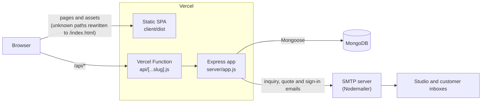

# Arthmala

**अर्थ Mala: art that heals, patterns that speak.** The web platform for a boutique Indian craft studio: a catalogue, commission inquiries, quotes, order tracking and an admin dashboard. A Sushraj Ventures business.

[](CHANGELOG.md)
[](https://github.com/DivisionCode/arthmala-platform/actions/workflows/ci.yml)
[](.nvmrc)
[](https://vuejs.org/)
[](https://vite.dev/)
[](https://expressjs.com/)
[](https://mongoosejs.com/)
[](https://arthmala.vercel.app)
[](LICENSE)

Live site: **https://arthmala.vercel.app**

## Contents

- [Overview](#overview)
- [Features](#features)
- [Tech stack](#tech-stack)
- [Architecture](#architecture)
- [Getting started](#getting-started)
- [Environment variables](#environment-variables)
- [Scripts](#scripts)
- [API overview](#api-overview)
- [Data model](#data-model)
- [Project structure](#project-structure)
- [Deployment on Vercel](#deployment-on-vercel)
- [Versioning and releases](#versioning-and-releases)
- [Contributing](#contributing)
- [Security](#security)
- [Licence](#licence)
- [Ownership](#ownership)

## Overview

Arthmala is a boutique studio preserving four living Indian crafts: Lipan Art, Mandala, Embroidery and Crochet. Every piece is made by hand, on commission.

This repository is a small monorepo with three parts:

| Path | Package | What it is |
| ---- | ------- | ---------- |
| `client/` | `arthmala-client` | Vue 3 single-page application built with Vite. |
| `server/` | `arthmala-api` | Express 5 API with MongoDB (Mongoose) and email through Nodemailer. |
| `api/` | (part of `arthmala-platform`) | Vercel Function that exposes the Express app under `/api/*`. |
| repository root | `arthmala-platform` | Build and install scripts that Vercel runs, plus `vercel.json`. |

Customers browse the catalogue, collect pieces in an inquiry list and send a commission inquiry. The studio replies with a quote from the admin dashboard, turns accepted quotes into orders and shares a private tracking link with the customer.

## Features

### Client

- **Catalogue** at `/products` with category filtering (`?category=`) and sorting by newest, oldest, price or name. The chosen sort order is remembered in the browser.
- **Product pages** at `/products/:id` with an image gallery, more pieces from the same craft, a WhatsApp enquiry link and Product and BreadcrumbList structured data (JSON-LD).
- **Inquiry list**: a drawer where customers collect pieces, set quantities and notes, and send an inquiry with their contact details, preferred contact method, budget, timeline and message. The list is kept in `localStorage` until it is sent.
- **Order tracking** at `/orders/:token`: a private page that shows order status, timeline and estimated delivery.
- **Passwordless sign-in** at `/login`: the visitor enters an email address, receives a six-digit code and exchanges it for a session token. The page also offers a WhatsApp option, but the API does not send WhatsApp messages yet (see [Passwordless sign-in](#passwordless-sign-in)).
- **Admin dashboard** at `/admin`, unlocked with the shared admin key:
  - Overview: inquiry totals by status, the last 30 days of activity, popular pieces and categories, inquiries left new for more than 48 hours and the quote pipeline.
  - Inquiries: change status, send or revise quotes, add and delete internal notes, update order status and ETA, and export to CSV.
  - Artworks: create, edit and delete artworks, with primary and gallery image upload by file picker or drag and drop.
- **Search and sharing**: per-page titles, descriptions, canonical links, Open Graph and Twitter card tags, JSON-LD, a web app manifest and an Open Graph card image.
- **Optional analytics**: Plausible or Google Analytics 4 is loaded only when the matching `VITE_*` variable is set.
- **Resilience**: a global Vue error handler, an error boundary around the app and a not-found page. `/portfolio` redirects to the home page.

### API

- **Artworks**: public read endpoints with a 10-minute in-memory cache that is cleared on every change, and admin-only create, update and delete.
- **Inquiries**: validation, a honeypot field and a minimum fill time against spam, and a rate limit of 8 submissions per 15 minutes per IP.
- **Email** (Nodemailer over SMTP): a notification to the studio and a confirmation to the customer for every inquiry, and a quote email when an inquiry first moves to `quoted` (or when the admin asks to resend a revised quote). If SMTP is not configured, inquiries are still saved and email is skipped.
- **Quotes and orders**: marking an inquiry as `quoted` requires a price. The first order update issues a random tracking token and each status change is added to the order timeline (`received`, `in_progress`, `shipped`, `delivered`).
- **Public order tracking** that returns only the customer's first name, items, quoted price and order progress, never contact details or notes.
- **Dashboard statistics** computed from inquiries and artworks.
- **Image upload** (Multer): JPEG, PNG, WebP, GIF or AVIF, up to 8 MB, stored under a random file name in `server/uploads/` and served from `/uploads/`.
- **SEO endpoints**: an XML sitemap of static pages and every artwork, and `robots.txt`.
- **Security**: Helmet headers, a CORS allow-list, a 1 MB JSON body limit, per-IP rate limits on inquiry submission, the admin inquiry and statistics routes and uploads, and a constant-time comparison of the admin key.

### Passwordless sign-in

1. The client sends `POST /api/auth/request-otp` with an `email` (or `phone`).
2. The API generates a six-digit code, keeps it in memory for 5 minutes and emails it. If `SMTP_HOST` is not set, or a `phone` was given, the code is printed to the server console instead.
3. The client sends `POST /api/auth/verify-otp` with the same identifier and the code.
4. On a match the code is deleted, the user is found or created in the `users` collection and the API returns a JSON Web Token signed with `JWT_SECRET` and valid for 7 days.
5. The client stores the token in `localStorage` and sends it as `Authorization: Bearer <token>` to `GET /api/auth/me`.

The admin dashboard does not use this sign-in. It is protected separately by the `ADMIN_TOKEN` shared key sent in the `x-admin-token` header.

## Tech stack

Versions are the ones resolved in `client/package-lock.json` and `server/package-lock.json`.

| Layer | Technology | Version | Purpose |
| ----- | ---------- | ------- | ------- |
| Runtime | Node.js | 22 (`.nvmrc`, `engines: 22.x`) | Runs the build, the API and CI |
| Client | Vue | 3.5.17 | UI framework (single-file components, `<script setup>`) |
| Client | Vue Router | 4.5.1 | Client-side routing with HTML5 history and lazy-loaded pages |
| Client | Pinia | 3.0.3 | State stores for artworks, the inquiry list and authentication |
| Client | @motionone/vue | 10.16.4 | Animation library; declared as a dependency but not imported by the current source |
| Client build | Vite | 7.0.5 | Dev server and production bundler |
| Client build | @vitejs/plugin-vue | 6.0.0 | Vue single-file component support for Vite |
| Client build | Tailwind CSS | 3.4.3 | Configured in the PostCSS pipeline; the source has no `@tailwind` directives, so styling comes from hand-written CSS |
| Client build | PostCSS | 8.5.6 | CSS processing pipeline |
| Client build | Autoprefixer | 10.4.21 | Vendor prefixes for CSS |
| Client assets | Google Fonts (Fraunces, Tiro Devanagari Hindi) | Hosted | Typography, loaded from `index.html` |
| Client integrations | Plausible or Google Analytics 4 | Hosted | Optional analytics, enabled by environment variables |
| Client integrations | WhatsApp click-to-chat (`wa.me`) | Hosted | Contact links built from `VITE_WHATSAPP_NUMBER` |
| API | Express | 5.1.0 | HTTP framework and routing |
| API | Mongoose | 8.16.4 | MongoDB object modelling |
| Database | MongoDB (Node.js driver) | 6.17.0 (driver) | Stores artworks, inquiries and users |
| API | jsonwebtoken | 9.0.3 | Signs and verifies sign-in tokens |
| API | helmet | 8.1.0 | Security headers |
| API | express-rate-limit | 8.3.2 | Per-IP rate limits |
| API | cors | 2.8.5 | Cross-origin allow-list |
| API | multer | 2.1.1 | Multipart image uploads |
| API | morgan | 1.10.1 | HTTP request logging |
| API | node-cache | 5.1.2 | In-memory artwork cache and one-time codes |
| API | nodemailer | 8.0.5 | SMTP email for inquiries, quotes and sign-in codes |
| API | dotenv | 17.2.0 | Loads `server/.env` in local development |
| API tooling | nodemon | 3.1.10 | Restarts the API on file changes (`npm run dev`) |
| Hosting | Vercel | Platform | Static hosting of `client/dist` and a Node.js Vercel Function for `/api/*` |
| CI | GitHub Actions (`actions/checkout`, `actions/setup-node`) | v7, v7 | Client build and API syntax check on every push and pull request |

## Architecture



In local development the same Express app runs on its own through `server/server.js` (port `PORT`, default `5000`) and the Vite dev server serves the client on port 5173. The client reaches the API through `VITE_API_URL`.

## Getting started

### Prerequisites

- Node.js 22 (run `nvm use` in the repository root to pick up [`.nvmrc`](.nvmrc)).
- A MongoDB database and its connection string.
- Optional: SMTP credentials, if you want emails to be sent.

### 1. Clone

```bash
git clone https://github.com/DivisionCode/arthmala-platform.git
cd arthmala-platform
```

### 2. API (`server/`)

```bash
cd server
cp .env.example .env    # fill in MONGO_URI, JWT_SECRET, ADMIN_TOKEN and the rest
npm ci
npm run dev             # nodemon, listens on http://localhost:5000
```

Check that it is up with `curl http://localhost:5000/api/health`, which returns `{"ok":true}`.

### 3. Client (`client/`)

In a second terminal:

```bash
cd client
cp .env.example .env.local   # keep VITE_API_URL=http://localhost:5000
npm ci
npm run dev                  # Vite, serves http://localhost:5173
```

The API allows `http://localhost:5173` by default (`CLIENT_ORIGIN`). The Vite config has no proxy, so `VITE_API_URL` must point at the API during local development.

### 4. Production build

```bash
cd client
npm run build     # outputs client/dist
npm run preview   # serves the build locally
```

To reproduce exactly what Vercel runs, use the root scripts from the repository root: `npm install` (its `postinstall` installs `server/`) and then `npm run build`.

## Environment variables

Never commit real values. Templates with placeholders are in [`client/.env.example`](client/.env.example) and [`server/.env.example`](server/.env.example). In production, set variables in the Vercel project settings.

### Client (`client/`, read at build time by Vite)

| Name | Required | Purpose |
| ---- | -------- | ------- |
| `VITE_API_URL` | No | Base URL of the API, for example `http://localhost:5000` locally. Leave empty on Vercel so the client calls same-origin `/api/*`. |
| `VITE_WHATSAPP_NUMBER` | No | WhatsApp number (country code and number, digits only) used for `wa.me` contact links. |
| `VITE_PLAUSIBLE_DOMAIN` | No | Enables Plausible analytics for this domain. Takes precedence over GA4. |
| `VITE_PLAUSIBLE_SRC` | No | Custom Plausible script URL (defaults to `https://plausible.io/js/script.js`). |
| `VITE_GA_ID` | No | Enables Google Analytics 4 with this measurement ID when Plausible is not set. |

`VITE_*` values are embedded in the public JavaScript bundle. Do not put secrets in them.

### Server (`server/`, read at runtime)

| Name | Required | Purpose |
| ---- | -------- | ------- |
| `MONGO_URI` | Yes | MongoDB connection string. |
| `JWT_SECRET` | Yes, in any deployed environment | Signs and verifies sign-in tokens. If unset, the code falls back to a built-in development value that must not be relied on in production. |
| `ADMIN_TOKEN` | Yes, for the admin dashboard | Shared key expected in the `x-admin-token` header. Admin routes return `503` while it is unset. |
| `CLIENT_ORIGIN` | Yes, in production | Comma-separated list of allowed browser origins for CORS. Defaults to `http://localhost:5173`. In production include the site origin, for example `https://arthmala.vercel.app`. |
| `PUBLIC_SITE_URL` | Recommended | Public site URL used in the sitemap and `robots.txt`. Defaults to `http://localhost:5173`. |
| `SMTP_HOST` | No | SMTP server. Without it, inquiry emails are skipped and sign-in codes are printed to the server console. |
| `SMTP_PORT` | No | SMTP port. Inquiry and quote emails default to `587` and use implicit TLS on `465`. |
| `SMTP_USER` | No | SMTP user name. Required together with `SMTP_HOST` and `SMTP_PASS` for inquiry and quote emails. |
| `SMTP_PASS` | No | SMTP password. |
| `SMTP_FROM` | No | Sender address. Inquiry emails fall back to `SMTP_USER`. |
| `DESIGNER_EMAIL` | No | Studio inbox that receives new inquiries and is used as the reply-to address on customer emails. |
| `UPLOAD_BASE_URL` | No | Base URL for links returned by the upload endpoint. Defaults to the protocol and host of the request. |
| `TRUST_PROXY` | No | Set to `true` to trust `X-Forwarded-For` behind a proxy, so rate limits see the real client IP. |
| `NODE_ENV` | No | `production` also enables `trust proxy` and switches request logs to the `combined` format. Vercel sets it automatically. |
| `PORT` | No | Port for local development through `server/server.js`. Defaults to `5000`. Not used on Vercel. |

## Scripts

### Root (`package.json`, used by Vercel)

| Script | Command | What it does |
| ------ | ------- | ------------ |
| `postinstall` | `npm install --prefix server` | Runs after `npm install` in the root and installs the API dependencies. |
| `build` | `npm install --prefix client && npm run build --prefix client` | Installs the client dependencies and builds the client into `client/dist`. |

### Client (`client/package.json`)

| Script | Command | What it does |
| ------ | ------- | ------------ |
| `dev` | `vite` | Starts the development server with hot reload on port 5173. |
| `build` | `vite build` | Builds the production bundle into `client/dist`. |
| `preview` | `vite preview` | Serves the production build locally. |

### Server (`server/package.json`)

| Script | Command | What it does |
| ------ | ------- | ------------ |
| `dev` | `nodemon server.js` | Starts the API and restarts it on file changes. |
| `start` | `node server.js` | Starts the API. |

There is no automated test suite yet. CI builds the client and runs `node --check` on every JavaScript file in `server/` and `api/`.

## API overview

All routes are defined in [`server/app.js`](server/app.js) and [`server/routes/`](server/routes). Responses are JSON unless stated otherwise.

Auth values: **Admin key** means the `x-admin-token` header must equal `ADMIN_TOKEN`. **Bearer JWT** means `Authorization: Bearer <token>` from the sign-in flow.

| Method | Path | Auth | Purpose |
| ------ | ---- | ---- | ------- |
| `GET` | `/api/health` | None | Liveness check. Returns `{ "ok": true }`. |
| `GET` | `/api/artworks` | None | List all artworks (cached for 10 minutes). |
| `GET` | `/api/artworks/categories` | None | List the allowed categories. |
| `GET` | `/api/artworks/:id` | None | Get one artwork. |
| `POST` | `/api/artworks` | Admin key | Create an artwork (`title`, `image`, `category` and `price` are required). |
| `PATCH` | `/api/artworks/:id` | Admin key | Update an artwork. |
| `DELETE` | `/api/artworks/:id` | Admin key | Delete an artwork. |
| `POST` | `/api/inquiries` | None (8 per 15 min per IP) | Submit a commission inquiry and send the notification and confirmation emails. |
| `GET` | `/api/inquiries` | Admin key (20 per 10 min per IP) | List the 200 most recent inquiries. |
| `PATCH` | `/api/inquiries/:id/status` | Admin key (20 per 10 min per IP) | Set status (`new`, `contacted`, `quoted`, `closed`); `quoted` needs `quotedPrice` and sends the quote email. |
| `PATCH` | `/api/inquiries/:id/order` | Admin key (20 per 10 min per IP) | Update order status and ETA; issues the tracking token on first use. |
| `POST` | `/api/inquiries/:id/notes` | Admin key (20 per 10 min per IP) | Add an internal note (up to 2000 characters). |
| `DELETE` | `/api/inquiries/:id/notes/:noteId` | Admin key (20 per 10 min per IP) | Delete an internal note. |
| `GET` | `/api/orders/:token` | Tracking token in the path | Public, sanitised order status for the tracking page. |
| `GET` | `/api/stats` | Admin key (20 per 10 min per IP) | Dashboard statistics. |
| `POST` | `/api/uploads` | Admin key (60 per 10 min per IP) | Upload one image as multipart field `file`; returns its URL. |
| `POST` | `/api/auth/request-otp` | None | Send a six-digit sign-in code to `email` (or log it for `phone`). |
| `POST` | `/api/auth/verify-otp` | None | Exchange `email` or `phone` plus `otp` for a JWT and the user profile. |
| `GET` | `/api/auth/me` | Bearer JWT | Return the signed-in user. |
| `GET` | `/api/sitemap.xml`, `/sitemap.xml` | None | XML sitemap of static pages and all artworks. |
| `GET` | `/api/robots.txt`, `/robots.txt` | None | `robots.txt` (plain text). |
| `GET` | `/uploads/:file` | None | Uploaded images, served as static files. |

Unknown routes return `404 {"error":"Not Found"}`. On Vercel only paths under `/api/` reach the Express app; see [Deployment on Vercel](#deployment-on-vercel).

## Data model

MongoDB collections, defined with Mongoose in [`server/models/`](server/models):

| Model | Key fields |
| ----- | ---------- |
| `Artwork` | `title`, `image`, `images`, `category` (`Lipan Art`, `Mandala`, `Embroidery`, `Crochet Art`), `description`, `price`, virtual `gallery` |
| `Inquiry` | contact details, `items`, `status`, `notes`, quote fields (`quotedPrice`, `quotedMessage`, `quotedAt`), order fields (`trackingToken`, `orderStatus`, `orderETA`, `orderTimeline`) |
| `User` | `email`, `phone`, `name`, `role` (`user` or `admin`) |

All three models store `createdAt` and `updatedAt` timestamps.

## Project structure

```text
.
├── api/
│   └── [...slug].js          # Vercel Function: exports the Express app for /api/*
├── client/                   # arthmala-client (Vue 3 + Vite)
│   ├── public/               # favicon, manifest, Open Graph card, images/
│   ├── src/
│   │   ├── assets/           # global CSS
│   │   ├── components/       # ArtCard, InquiryDrawer, FloatingActions, SiteFooter, ErrorBoundary, ...
│   │   ├── composables/      # usePageMeta, useJsonLd, useAnalytics
│   │   ├── layouts/          # DefaultLayout, DefaultProductPage
│   │   ├── pages/            # Home, Products, ProductDetail, About, OrderTracking, Login, Admin, NotFound
│   │   │   └── admin/        # AdminOverview, AdminInquiries, AdminProducts
│   │   ├── router/           # Vue Router routes
│   │   ├── stores/           # Pinia stores: artworks, inquiry list, auth
│   │   ├── App.vue
│   │   └── main.js
│   ├── .env.example
│   ├── index.html
│   ├── package.json
│   ├── postcss.config.js
│   ├── tailwind.config.js
│   └── vite.config.js
├── server/                   # arthmala-api (Express + Mongoose)
│   ├── controllers/          # artworks, auth, inquiries, SEO, stats, uploads
│   ├── middleware/           # rate limits, admin key, JWT auth
│   ├── models/               # Artwork, Inquiry, User
│   ├── routes/               # Express routers mounted under /api
│   ├── uploads/              # uploaded images (git-ignored, folder kept)
│   ├── utils/                # mailer, sign-in code sender
│   ├── .env.example
│   ├── app.js                # Express app (used locally and by api/)
│   ├── package.json
│   └── server.js             # local entry point: app.listen(PORT)
├── .github/                  # CI workflow, code owners, issue and PR templates
├── .editorconfig
├── .nvmrc
├── CHANGELOG.md
├── CONTRIBUTING.md
├── LICENSE
├── package.json              # arthmala-platform: Vercel build and install scripts
├── README.md
├── SECURITY.md
└── vercel.json               # SPA fallback rewrite
```

## Deployment on Vercel

The whole repository deploys as one Vercel project. Production is https://arthmala.vercel.app.

### How the pieces fit

1. **Install.** Vercel runs `npm install` in the repository root. The root `postinstall` script then runs `npm install --prefix server`, so the API dependencies are available to the function.
2. **Build.** The build command `npm run build` runs `npm install --prefix client && npm run build --prefix client`, which writes the static site to `client/dist`.
3. **Static site.** Vercel serves `client/dist` as static files.
4. **API.** `api/[...slug].js` is a zero-config catch-all Vercel Function. It imports `server/app.js` and exports the Express app, so every request under `/api/` is handled by Express.
5. **SPA fallback.** [`vercel.json`](vercel.json) rewrites `/(.*)` to `/index.html`. Requests that match a static file or the function are served directly; every other path returns `index.html` so that Vue Router can render routes such as `/products/:id` or `/admin`.

### Project settings

Configure the Vercel project as follows (carried over from the original deployment notes):

1. **Root Directory**: `./` (the repository root, **not** `client`).
2. **Framework Preset**: `Vite`.
3. **Build Command**: `npm run build`.
4. **Output Directory**: `client/dist`.
5. **Environment Variables**: define the server variables from [Environment variables](#server-server-read-at-runtime) (at least `MONGO_URI`, `JWT_SECRET`, `ADMIN_TOKEN` and `CLIENT_ORIGIN`). Leave `VITE_API_URL` unset or empty so the client uses relative `/api/*` paths.

Vercel reads the Node.js version from the root `package.json` `engines.node` field (`22.x`), which keeps production on Node 22 rather than moving to a newer major on its own.

### Things to know when running on Vercel

- Only paths under `/api/` reach Express. The top-level `/sitemap.xml`, `/robots.txt` and `/uploads/*` routes of the Express app are therefore not reachable there, because `vercel.json` rewrites those paths to `index.html`; the `/api/sitemap.xml` and `/api/robots.txt` variants are.
- `POST /api/uploads` writes files to `server/uploads/` on the local file system. Vercel Functions do not provide persistent disk storage, so uploads should be treated as a local development feature unless storage is moved elsewhere.
- Sign-in codes and the artwork cache are held in process memory (node-cache). They do not survive a restart and are not shared between function instances.

## Versioning and releases

- The project follows [Semantic Versioning](https://semver.org/spec/v2.0.0.html). The root, client and server packages always carry the same version.
- Every notable change is recorded in [CHANGELOG.md](CHANGELOG.md), which follows [Keep a Changelog](https://keepachangelog.com/en/1.1.0/). New entries go under `[Unreleased]`.
- Releases are tagged `vX.Y.Z` on `main` and published as GitHub Releases with the matching changelog section.
- Commit messages follow [Conventional Commits](https://www.conventionalcommits.org/en/v1.0.0/).

The step-by-step release process is in [CONTRIBUTING.md](CONTRIBUTING.md#releasing).

## Contributing

See [CONTRIBUTING.md](CONTRIBUTING.md) for local setup, branch naming (`feature/`, `fix/`, `chore/`, `docs/`), commit conventions, pull requests and releases. All pull requests target `main` and need a passing CI run.

## Security

Please do not report vulnerabilities in public issues. Email **sushrajventures@gmail.com** and see [SECURITY.md](SECURITY.md) for the full policy.

## Licence

Proprietary. Copyright (c) 2025-2026 Sushraj Ventures. All rights reserved. The source is published for reference only; no licence is granted to use, copy, modify or distribute it without prior written permission. See [LICENSE](LICENSE).

## Ownership

Arthmala is a business of **Sushraj Ventures**, a sole proprietorship of Rohit Singh.

- Website: https://arthmala.vercel.app
- Repository: https://github.com/DivisionCode/arthmala-platform
- Contact: sushrajventures@gmail.com
